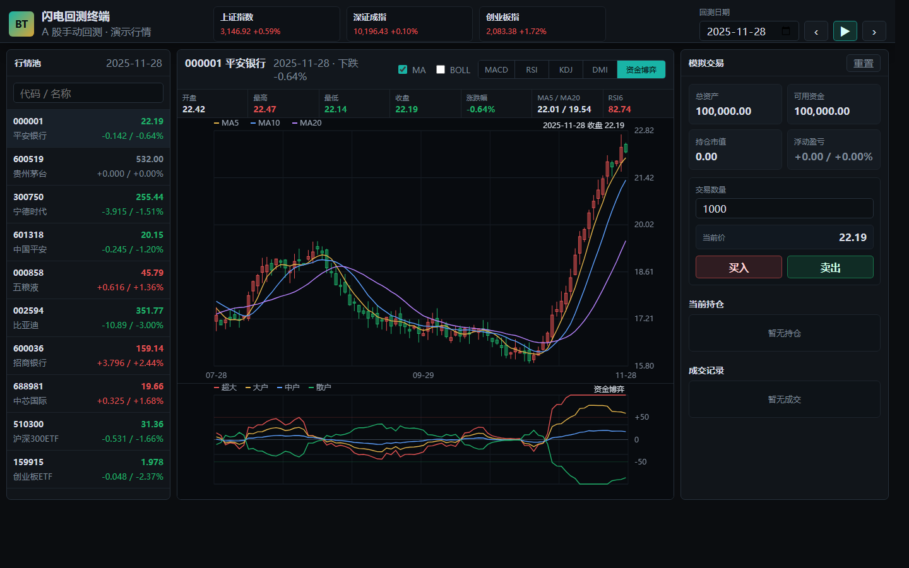

# 股票回测终端原型

这个目录是一个可直接打开的前端原型，用来验证你的核心产品想法：

- 同花顺式行情终端布局：行情池、K 线区、指标区、交易面板、成交记录。
- 设置回测日期后，只显示该日期及之前的数据。
- 逐日推进回测，未来 K 线、指标和账户浮盈都不会提前暴露。
- 支持按当前回测日收盘价模拟买入、卖出、持仓和资金变化。
- 内置演示行情，并计算 MA、BOLL、MACD、RSI、KDJ、DMI、资金博弈。

说明：DMI 采用通用技术指标公式；资金博弈为基于价量资金流强弱的近似实现，用于原型演示，后续接入真实行情源后可以替换为东方财富同口径数据或你自己的资金流模型。

打开方式：

```text
stock-backtester-prototype/index.html
```

当前版本不依赖后端和网络，行情是前端生成的演示数据。后续可以把数据层替换成你的 `tupo` 仓库：



1. `tupo` 负责读取通达信/本地行情、复权、指标计算、账户撮合和绩效分析。
2. 前端通过 FastAPI 接口拉取某只股票在某个回测日之前的数据。
3. 后端接口必须强制接收 `as_of_date`，并在服务端截断数据，防止前端误拿未来数据。
4. 手动回测模式保存为一条 `session`，每次买卖保存为 `order/trade`，方便复盘。

推荐的后端接口草案：

```http
GET /api/stocks
GET /api/bars?symbol=000001&as_of=2026-01-15&adjust=qfq
GET /api/indicators?symbol=000001&as_of=2026-01-15&items=ma,macd,rsi,boll,kdj
POST /api/sessions
POST /api/sessions/{id}/orders
GET /api/sessions/{id}/account?as_of=2026-01-15
GET /api/sessions/{id}/trades?as_of=2026-01-15
```

关键原则：所有“未来不可见”的规则都应同时在前端和后端实现，但以后端为准。
